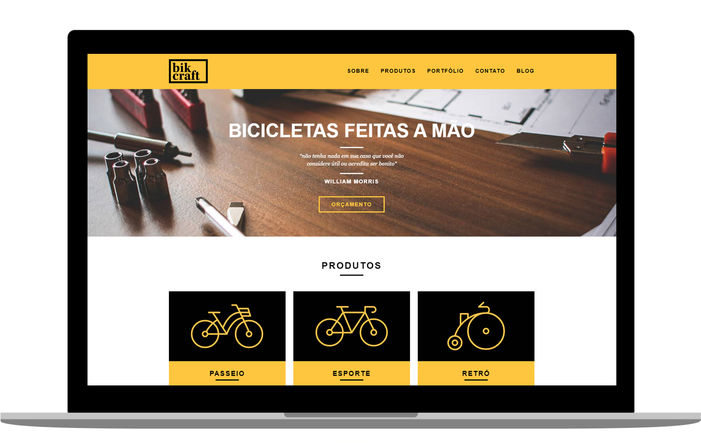

<h1 align="center">
  BIKCRAFT
</h1>

   
   

  
  
  

  

## ◾ Projeto

O Bikcraft é um projeto totalmente responsivo feito com HTML, CSS e Javascript puro. O principal intuito era não usar nenhuma biblioteca ou framework para treinar tecnicas de CSS e Javascript.

#### Visitar o site: [Bikcraft.com](https://bikcraft.com/)

## ◾ Tecnologias

Esse projeto foi desenvolvido com as seguintes tecnologias:

- [HTML](https://developer.mozilla.org/pt-BR/docs/Web/HTML)
- [CSS](https://developer.mozilla.org/pt-BR/docs/Web/CSS)
- [JAVASCRIPT](https://developer.mozilla.org/pt-BR/docs/Web/JavaScript)
- [PHP](https://www.php.net/docs.php)

## ◾ Licença

Esse projeto está sob a licença MIT
